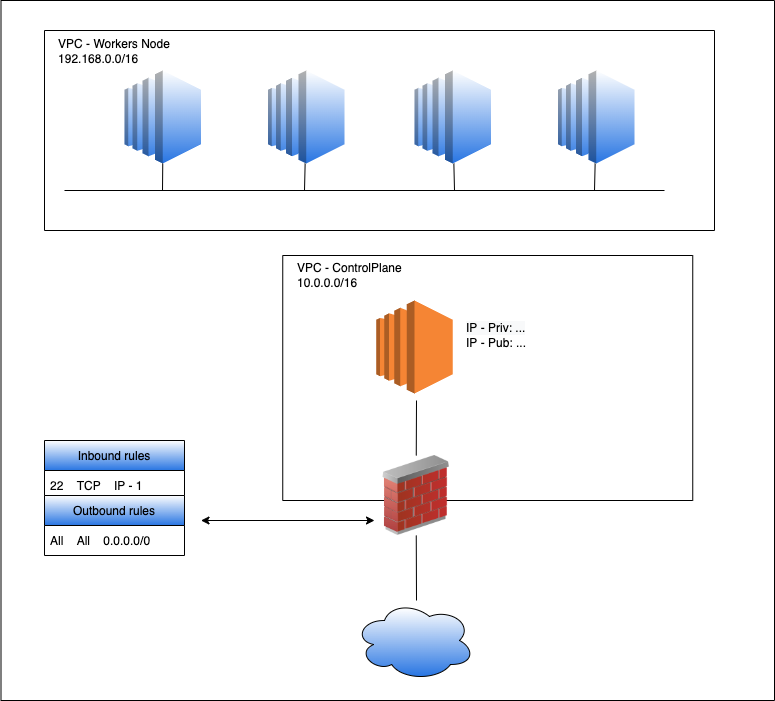

# A VULNERABLE AWS ENVIRONMENT
This project aims to create a virtual environment on AWS with a vulnerable infrastructure and: 
- Vulnerable APIs (container).
- Vulnerable WebApp (container).

The final goal of this project is to start work with AWS and the technologies used to manage this infrastructure, such as Terraform, Docker, Kubernetes, and all AWS services.
Moreover, the environment will be deployed in an automated fashion. To this end, the services will be containers (e.g., Docker container). 
Finally, the environment will be subject to a penetration testing analysis (followed by a report).

Authors: 
- Marco Brotto,
- Jonas Kirch, and
- Nuri Yilmaz.

## Installation

## Set up of an EKS Cluster on AWS
In this section, we describe how to create an EKS cluster on AWS. The aim of this task is to deploy two EKS Deployments. Each of them contains 3 replicas of vulnerable docker applications, in particular, Juice-Shop and VampI API.

To install and deploy the cluster, we followed these steps:

- Log in to an EC2 instance and install `aws` (v2), `eksctl` and `kubectl`.
- Create the cluster with `eksctl create cluster`. This operation might take up to 20 minutes.
- Update the *kubeconfig* file with the command `aws eks update-kubeconfig --name devMarco --region us-east-1`.
- Create a namespace to put all the future services and deployments: `kubectl create namespace vulnerable-ns`.
- Create the services and deployments objects using `kubectl`. In particular, to create the services and the deployments we have used the [svc.yml](ymlFiles/svc.yml) file and [deplyments.yml](ymlFiles/deployments.yml) file respectively.
  - `kubectl create -f svc.yml` to create the services.
  - `kubectl create -f deployments.yml` to create the deployments.

## Network Diagram

## Learning Outcomes

## Resources
- [Juice Shop](https://github.com/juice-shop/juice-shop): vulnerable WebApp.
- [VAMPI](https://github.com/erev0s/VAmPI): vulberable APIs.
- [VAMPI Solution](https://erev0s.com/blog/vampi-vulnerable-api-security-testing/)
- [TerraGoat](https://github.com/bridgecrewio/terragoat): vulnerable Terraform Infrastructure.
- [CloudMapper](https://github.com/duo-labs/cloudmapper): cloud tool to map AWS/Azure/GCP cloud infrastructure. This tool is useful to extract a network diagram of the entire cloud system.
- [ScoutSuite](https://github.com/nccgroup/ScoutSuite): cloud tool to create a security report about the AWS miscofnigurations (e.g., weak password policy).
- [Cloud Guru](https://acloudguru.com/): learning platform.
