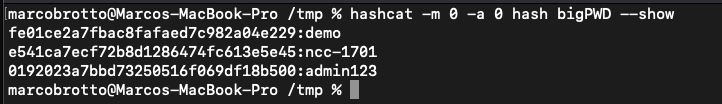

# JUICE-SHOP PENTEST REPORT

This document provides a report of the vulnerabilities that we have found on Juice Shop WebApplication.


## 1. SQL Injection

### Description

A SQL injection attack consists of the insertion or "injection" of a SQL query via the input data from the client to the application. A successful SQL injection exploit can read sensitive data from the database, modify database data (Insert/Update/Delete), execute administration operations on the database, recover the content of a given file present on the DBMS file system, and in some cases issue commands to the operating system. SQL injection attacks are a type of injection attack, in which SQL commands are injected into data-plane input in order to affect the execution of predefined SQL commands. The login page is vulnerable to SQL injection attacks using that an attacker can log in to the application without knowing the credentials.

### Steps

- Checked for a login field to input user commands.
Tried to check for a security misconfiguration by adding a ' Symbol.

```
POST /rest/user/login HTTP/1.1
...

{
"email":"'",
"password":"1"
}
```

Responded with an SQLite error and also the SQL tables and password hash.

- Checked for a simple SQL injection by trying to bypass the authentication process with 

```
POST /rest/user/login HTTP/1.1
Accept: application/json, text/plain, */*

{
 "email":"'or 1=1 --",
 "password":"1"
}
```

### PoC

we check for security misconfiguration


we bypass the login authentication process and are able to login as admin.


### Mitigation

To prevent SQL Injection attacks you should implement input validation and parameterized queries, including prepared statements. The application code should never use the input directly. The developer must sanitize all input, not only web form inputs such as login forms. They must remove potential malicious code elements such as single quotes. It is also a good idea to turn off the visibility of database errors on your production sites. Database errors are used with SQL Injection to gain information about your database.

## 2. Identification and Authentication Failures

### Description
Identification and authentication failures can occur when functions related to a user's identity, authentication, or session management are not implemented correctly or not adequately protected by an application. Attackers may be able to exploit identification and authentication failures by compromising passwords, keys, session tokens, or exploit other implementation flaws to assume other users' identities, either temporarily or permanently.

### Steps

By using the above SQL Injection to bypass the Authentication process we got access to the authentication token.

Next Step was to decode the Token and then to decrypt the password hash.

### PoC

Authentication Token


Decoded Token


Decrypted hash


Login as admin with password 


Succesfully logged in


### Mitigation

- Where possible, implement multi-factor authentication to prevent automated credential stuffing, brute force, and stolen credential reuse attacks.
- Do not ship or deploy with any default credentials, particularly for admin users.
- Implement weak password checks, such as testing new or changed passwords against the top 10,000 worst passwords list.
- Align password length, complexity, and rotation policies with National Institute of Standards and Technology (NIST) 800-63b's guidelines in section 5.1.1 for Memorized Secrets or other modern, evidence-based password policies.
- Ensure registration, credential recovery, and API pathways are hardened against account enumeration attacks by using the same messages for all outcomes.
- Limit or increasingly delay failed login attempts, but be careful not to create a denial of service scenario. Log all failures and alert administrators when credential stuffing, brute force, or other attacks are detected.
- Use a server-side, secure, built-in session manager that generates a new random session ID with high entropy after login. Session identifier should not be in the URL, be securely stored, and invalidated after logout, idle, and absolute timeouts.


## 3. CSRF in the update of the username

### Description
Cross-Site Request Forgery (CSRF) is an attack that forces authenticated users to submit a request to a Web application against which they are currently authenticated. CSRF attacks exploit the trust a Web application has in an authenticated user. 

### Steps 

An HTML page with this form will cause the user to automatically update his username

```
<html>
  <!-- CSRF PoC - generated by Burp Suite Professional -->
  <body>
    <form action="http://127.0.0.1:3000/profile" method="POST">
      <input type="hidden" name="username" value="CSRFIsSerious" />
    </form>
		<script>document.forms[0].submit()</script>
  </body>
</html>
```

### PoC
When the user clicks on the link that is responsible for sending the previous form, then the username is changed.


### Mitigation
Implement CSRF token with random value

## 4. Reflected XSS (Cross Site Scripting)
### Description
A reflected XSS (also called a non-persistent XSS attack) is a specific type of XSS whose malicious script bounces off of another website to the victim's browser. It is passed in the query, typically, in the URL. It makes exploitation as easy as tricking a user to click on a link.
In this case, we can inject the malicious code into the search parameter of the URL. 

For example, the URL `http://127.0.0.1:3000/search?q=` will pop up an alert message. In other words, this allows an attacker to execute arbitrary JS on the victim's browser.
### PoC

We use the search parameter in the URL to load an image. We add the error handler that is triggered if the image does not exist. The error handler contains JS that is executed because the image does not exist.


### Mitigation

For XSS attacks to be successful, an attacker needs to insert and execute malicious content on a webpage. Each variable in a web application needs to be protected. Ensuring that all variables go through validation and are then escaped or sanitized is known as perfect injection resistance. Any variable that does not go through this process is a potential weakness. Frameworks make it easy to ensure variables are correctly validated and escaped or sanitized.

## 5. Security Misconfiguration in the HTTP header

### Description

The server does not send security headers or directives, or they are not set to secure values. In this scenario the following HTTP headers are missing:

- For cookies missing httpOnly and secure headers. To this end, cookies can be sent over HTTP and they can be accessed by DOM functions such as `document.cookie`.

- For HTTPS connection missing the HSTS header. The connection is established over HTTP.

- CORS policy is too weak. In fact, the header `Access-Control-Allow-Origin: *` tells browsers to allow requesting code from any origin to access the resource. 

## 6. SQL Injection to exfiltrate all the DB schema
### Description
### Steps
When the main page is loaded, the query parameter in the GET request allows a user to retrieve all the products stored in the DB.
```
Request: GET /rest/products/search?q=
Response: list of JSON objects
```
If we modify the `q` value in the URL parameter, then we perform a UNION SQL injection attack, i.e., exfiltrate data, such as the schema of the DB. 

The query that is executed on the backend is the following: 

```
SELECT *
FROM Products
WHERE ((name LIKE '1%' AND 'a'='b'))
UNION
SELECT name, "a", ..., "a"
FROM sqlite_schema --
```

The next figure shows the table that we were able to exfiltrate.


We can extract the schema of the Users table with the following query:

```
SELECT *
FROM Products
WHERE ((name LIKE '1%' AND 'a'='b'))
UNION
SELECT name, "a", ..., "a"
FROM pragma_table_info('Users') --
```

Then we try to exfiltrate usernames, mail, password and other interesting informaiton. We use the following query:

```
SELECT *
FROM Products
WHERE ((name LIKE '1%' AND 'a'='b'))
UNION
SELECT username, email, password, deluxeToken, lastLoginIp, role, totpSecret, "a", "a"
FROM Users --
```


Finally, we can observe that the passwords are stored as MD5 digests (without salt). This event evidence two problems, i.e., (i) the usage of an outdated algorithm (MD5), and an insecure way to store the passwords, i.e., without salt. The last finding allows an attacker to run an offline dictionary attack and discover an "easy" password.



## 7. Sensitive Data Exposure

### Description

Sensitive Data Exposure occurs when an organization unknowingly exposes sensitive data or when a security incident leads to the accidental or unlawful destruction, loss, alteration, or unauthorized disclosure of, or access to sensitive data. Such Data exposure may occur as a result of inadequate protection of a database, misconfigurations when bringing up new instances of datastores, inappropriate usage of data systems and more.

### Steps

Scanned Juice-Shop on Burp Suite and found an open ftp folder. Inside was a confidential file called acquisitions.md

### PoC

Result of scanning.


Opening the file.


### Mitigation

* Classify data processed, stored or transmitted by an application. Identify which data is sensitive according to privacy laws, regulatory requirements, or business needs.
* Apply controls as per the classification.
* Don’t store sensitive data unnecessarily. Discard it as soon as possible or use PCI DSS compliant tokenization or even truncation. Data that is not retained cannot be stolen.
* Make sure to encrypt all sensitive data at rest.
* Ensure up-to-date and strong standard algorithms, protocols, and keys are in place; use proper key management.
* Encrypt all data in transit with secure protocols such as TLS with perfect forward secrecy (PFS) ciphers, cipher prioritization by the server, and secure parameters. Enforce encryption using directives like HTTP Strict Transport Security (HSTS).
* Disable caching for response that contain sensitive data.
* Store passwords using strong adaptive and salted hashing functions with a work factor (delay factor), such as Argon2, scrypt, bcrypt or PBKDF2.
* Verify independently the effectiveness of configuration and settings


## 8. Broken Access Control

### Description
Access control enforces policy such that users cannot act outside of their intended permissions. Failures typically lead to unauthorized information disclosure, modification, or destruction of all data or performing a business function outside the user's limits.

### Steps
If you intercept the HTTP requests with burpsuite when clicking on Your Basket you will notice the requests GET /rest/basket/6. In this case the  "6" is the identifier for the user's basket. If you change the identifer for example into "1" you will see the basket of an other user, in this case the user admin.

### PoC


### Mitgation
Access control vulnerabilities can generally be prevented by taking a defense-in-depth approach and applying the following principles:
	• Never rely on obfuscation alone for access control.
	• Unless a resource is intended to be publicly accessible, deny access by default.
	• Wherever possible, use a single application-wide mechanism for enforcing access controls.
	• At the code level, make it mandatory for developers to declare the access that is allowed for each resource, and deny access by default.
	• Thoroughly audit and test access controls to ensure they are working as designed.
	
	
## 9. Improper Input Validation

### Description
Input validation is a frequently-used technique for checking potentially dangerous inputs in order to ensure that the inputs are safe for processing within the code, or when communicating with other components. When software does not validate input properly, an attacker is able to craft the input in a form that is not expected by the rest of the application. This will lead to parts of the system receiving unintended input, which may result in altered control flow, arbitrary control of a resource, or arbitrary code execution.

### Steps
In the UI of the application it is not possible to set the quantities in the shopping cart into a negative range. But if you set the intercepter of Burpsuite on, before adding the item to your cart, you can intercept the request as shown below. In here you can change the quantity into a negative range e.g. - 100. Therefore a negative price is displayed in the shopping cart.

### PoC


### Mitigation
A common mistake most developers make is to include validation routines in the client-side of an application using JavaScript functions as a sole means to perform bounds checking. It is important to note that while client-side validation is excellent for UI and functional validation, it isn't a substitute for server-side validation. Performing validation on the server-side ensures the integrity of your validation controls. The server-side validation routine will always be effective irrespective of the state of JavaScript execution on the browser. A best practice would be to implement both Client-side and Server-side validation.

## 10. Broken Anti Automation

### Discription
Insufficient Anti-automation occurs when a web application permits an attacker to automate a process that was originally designed to be performed only in a manual fashion, i.e. by a human web user. Once exploited, attackers can use an automatic tool or a simple script that performs a brute-force authentication attempts, and possible cause a legitimate user lock out.

### Steps
We have discovered that the captcha in the "Contact Us" form on the feedback page can be bypassed. With the help of BurpSuite, unregistered users can submit multiple feedbacks in a short amount of time.
For this, you have to intercept the successful request of the feedback in Burpsuite and then submit it in the repeater as many times as you want.

### PoC
In the following snippets you can see that with the exact same request a successful feedback can be sent in a short period of time.


### Mitigation
Allow only registered users to provide feedback and limit the number of comments each registered user can provide within a given time period.

## 11. Improper Input Validation

### Description
Input validation is a frequently-used technique for checking potentially dangerous inputs in order to ensure that the inputs are safe for processing within the code, or when communicating with other components. When software does not validate input properly, an attacker is able to craft the input in a form that is not expected by the rest of the application. This will lead to parts of the system receiving unintended input, which may result in altered control flow, arbitrary control of a resource, or arbitrary code execution.

### Steps
In order to submit a 0-star rating, a normal rating must first be submitted via the user interface. Then you have to change the successful rating in the repeater via BurpSuite. For this, the field "rating:" must be set to "0".

### PoC


### Mitigation
A common mistake most developers make is to include validation routines in the client-side of an application using JavaScript functions as a sole means to perform bounds checking. It is important to note that while client-side validation is excellent for UI and functional validation, it isn't a substitute for server-side validation. Performing validation on the server-side ensures the integrity of your validation controls. The server-side validation routine will always be effective irrespective of the state of JavaScript execution on the browser. A best practice would be to implement both Client-side and Server-side validation.
