# VAMPI PENTEST REPORT

This document provides a report of the vulnerabiilties that we have found on VampI APIs.

## Brute Force Password Discovery of the JWT
### Description
JWT, or JSON Web Token, is an open standard used to share security information between two parties — a client and a server. Each JWT contains encoded JSON objects, including a set of claims. JWTs are signed using a cryptographic algorithm to ensure that the claims cannot be altered after the token is issued. In this context, we retrieve a JWT and we try to recover the encryption key, that in this scenario was a passsword.

### Steps
1. We retrieve a JWT when we log in with our user (that we previously registered).
2. We decode the token and we find the encryption algorithm that is used (HS256).
3. We create a wordlist and we brute force the password
   ```
   f = open(wordlist)
   for pwd in wordlist.lines:
    mySign = HMAC-SHA256( base64UrlEncode(header) + “,” +  base64UrlEncode(payload), pwd )
    if base64.b64encode(mySign) == signature:
        return pwd
   ```
### PoC

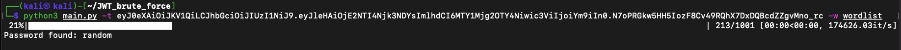

### Mitigation
The signature must be created with a secret key or a STRONG password that has to follow these specifications: 
- At least 12 characters (required for your Muhlenberg password)—the more characters, the better
- A mixture of both uppercase and lowercase letters
- A mixture of letters and numbers 
- Inclusion of at least one special character, e.g., ! @ # ? ]


## Forge JWT with Longer Expiration Date


## Update of Password of Admin User
### Description
This vulnerability is related to a bug in the code. In particular, an authenticated user can modify the password of any user in the database (including the admin).

The API responsible for this behavior is `PUT /users/v1/{username}/password`.

### Steps
We log in with our user (Bob) and we retrieve the authentication JWT token.
We modify the admin password with the following HTTP request
```
PUT /users/v1/admin/password
...
Authorization: {JWT TOKEN}
Content-type: application/json
{   
   "password" : "qwerty"
}
```
### PoC
1. We update the password of the admin.

   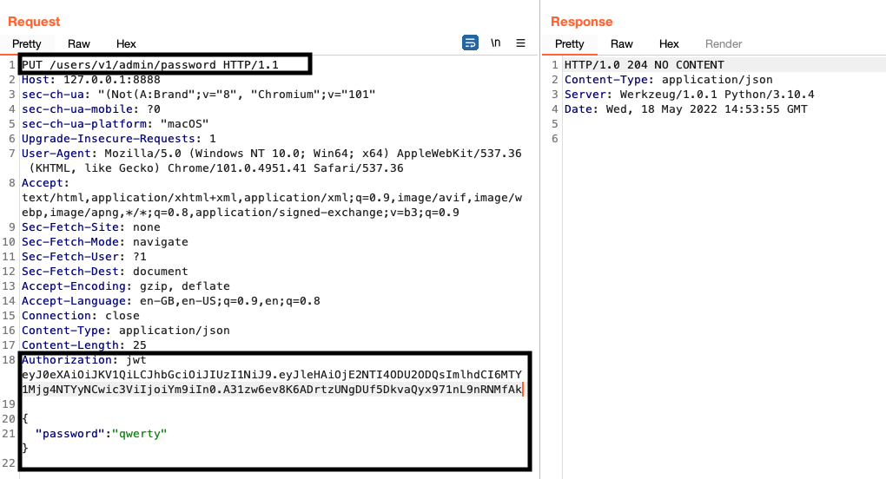

2. We login with the new admin's password.
   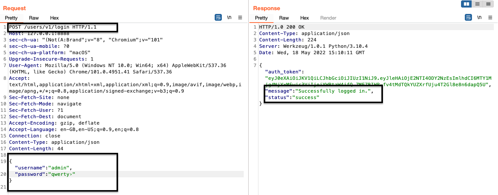

### Mitigation
Review the source code and allow the users to modify their password checking the username stored in the JWT (not the one in the URL).

## User Enumeration
### Description
The username enumeration is an activity in which an attacker tries to retrieve valid usernames from a web application. The web applications are mostly vulnerable to this type of attack on login pages, registration form pages or password reset pages.

The are several APIs vulnerable to user enumerations in VampI.
- POST /users/v1/register
   - This POST request requires a JSON object as input: {"username": "test1",  "password": "tes1", "email": "test1"}.
   - If the application receives a JSON object with the structure {"username" : "test1"}, it first checks if "test1" is present in the DB, if yes, the application replies back with 200 OK saying that the username is already present in the DB, otherwise (test1 is not present in the DB) the application replies with an error code because the structure of the input is wrong.

### PoC
When sending a POST request, the payload is crafted using BurpSuite and we sent only the username of an existing account.
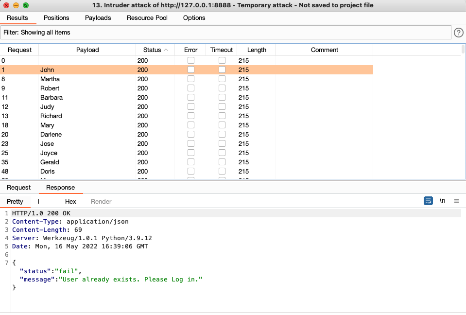

### Mitigation
1. Login Page
  - Make sure to return a generic “No such username or password” message when a login failure occurs.
  - Make sure the HTTP response, and the time taken to respond are no different when a username does not exist, and an incorrect password is entered.
2. Registration Page
  - Avoid having your site tell people that a supplied username is already taken.
  - If your usernames are email addresses, send a password reset email if a user tries to sign-up with an existing address.
  - If usernames are not email addresses, protect your sign-up page with a CAPTCHA.

### Side notes: 
The email field is not checked in the backed, for instance, a wrong email address does not trigger any error in the application.


## SQL Injection

### Description

A SQL injection attack consists of insertion or "injection" of a SQL query via the input data from the client to the application. A successful SQL injection exploit can read sensitive data from the database, modify database data (Insert/Update/Delete), execute administration operations on the database, recover the content of a given file present on the DBMS file system and in some cases issue commands to the operating system. SQL injection attacks are a type of injection attack, in which SQL commands injected into data-plane input in order to effect the execution of predefined SQL commands. The login page is vulnerable to SQL injection attacks using that an attacker can login to the application without knowing the credentials. 


### Steps
When sending the follwing request
```GET /users/v1/admin'&200R&20'1'='1```
the response in Burpsuite showing the credentials for the user "name1".

### PoC 1
.png)

### Steps
When sending the floowing request
```GET /users/v1/_debug'```
the response in BurpSuite shows an error which shows the SQL-statement. From the previous image we observe that the parameter that the user can manipulate is directly executet in the query. To this end, this API is also vulnerable to SQL-Injection.

### PoC 2
.png)

### (New) Discover Super Admin Password via SQL injection
As we have previously discussed, the API to retrieve the information of a user is vulnerable to SQL injection. To this end, we try to recover the password of the Admin.First, we recover the length of the password with the following query
```
SELECT *
FROM Users
WHERE username = "admin" AND LENGHT(SELECT Password FROM Username WHERE username = "admin") > 10--- "
```
We continue until we found the length of the password (binary search).

Then, we brute force the password using the SUBSTRING operator and Cluster Bomb attack to specify two payloads:
```
SELECT *
FROM Users
WHERE username = "admin" AND '§char§' = (SELECT SUBSTRING(password, §n§, 1) FROM Users WHERE username = "admin")--- "
```
We iterate over each character until we found the entire password. To perform this attack we use Intruder.

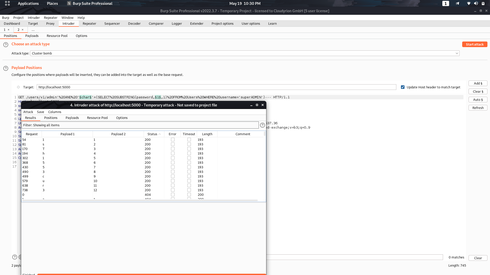

### Mitigation

To prevent SQL Injection attacks is input validation and parametrized queries including prepared statements. The application code should never use the input directly. The developer must sanitize all input, not only web form inputs such as login forms. They must remove potential malicious code elements such as single quotes. It is also a good idea to turn off the visibility of database errors on your production sites. Database errors used with SQL Injection to gain information about your database. 

## Bola Broken Object Level Authorization

### Description

Broken object level authorization is a security vulnerability that occurs when an application does not correctly confirm that the user making the request has the required privileges.

### Steps

We login with a user, in this case "name2". We want to view the books (bookTitle2) that user "name1" should only be able to see.
So we use Token of User "name2" to view bookTitle2.

```
GET /books/v1/bookTitle2 HTTP/1.1
...
Authorization: {JWT Token}
```

### PoC

User "name2" Authentication Token:

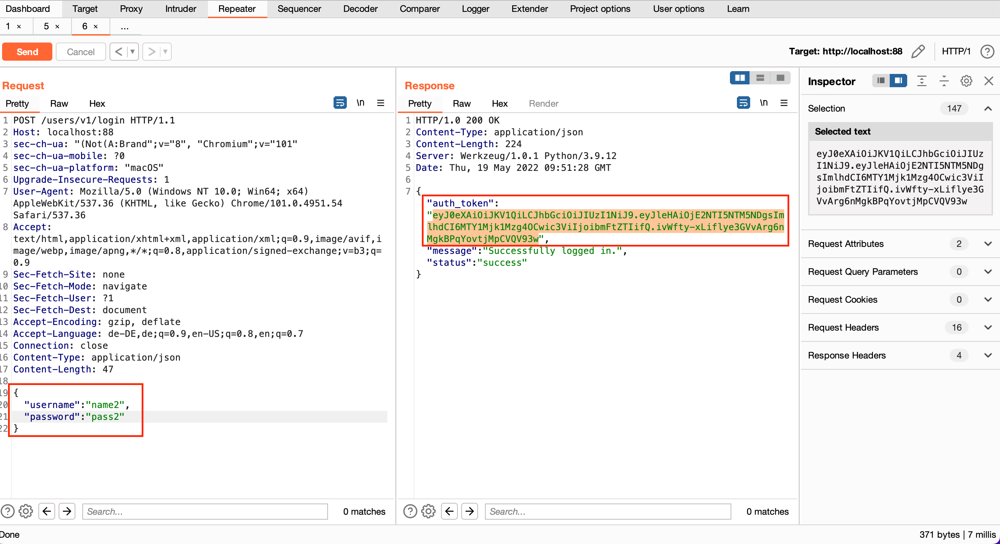

We were able to see the book as user "name2":

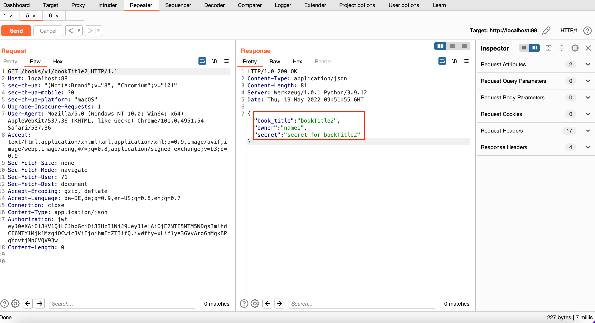

### Mitigation

- Implement a proper authorization mechanism that relies on the user policies and hierarchy.
- Use an authorization mechanism to check if the logged-in user has access to perform the requested action on the record in every function that uses an           input from the client to access a record in the database.
- Prefer to use random and unpredictable values as GUIDs for records’ IDs.
- Write tests to evaluate the authorization mechanism. Do not deploy vulnerable changes that break the tests.


## Mass Assignment

### Description

Software frameworks sometime allow developers to automatically bind HTTP request parameters into program code variables or objects to make using that framework easier on developers. This can sometimes cause harm.
Attackers can sometimes use this methodology to create new parameters that the developer never intended which in turn creates or overwrites new variable or objects in program code that was not intended. This is called a Mass Assignment vulnerability.

### Steps

Tried to create a new User with Admin rights, which shouldnt be possible for anyone without admin rights. In this case we created a new user named "RuffyJK".

```
POST /users/v1/register
...
Authorization: {JWT TOKEN}
Content-type: application/json
{   
   "admin":"true",
   "email":"RuffyJK",
   "username":"RuffyJK",
   "password":"1234"
   
}
```


### PoC

Succesfully created a user "RuffyJK" with admin rights.

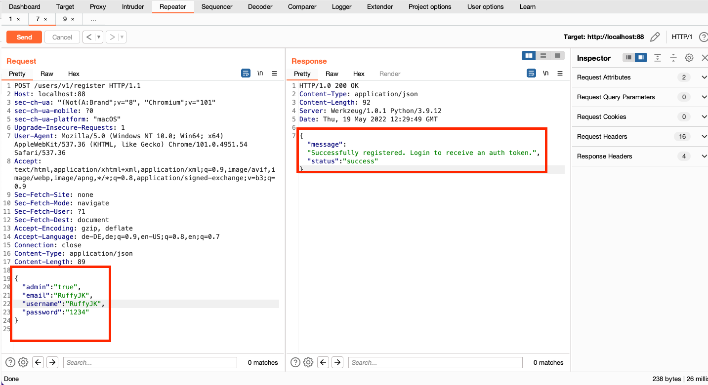

### Mitigation

- Do not automatically bind incoming data and internal objects.
- Explicitly define all the parameters and payloads you are expecting.
- Use the readOnly property set to true in object schemas for all properties that can be retrieved through APIs but should never be modified.
- Precisely define the schemas, types, and patterns you will accept in requests at design time and enforce them at runtime.


## Lack of Resources & Rate Limiting

### Description

Each API can be requested an unlimited number of times. For example, when the users log in, they can "miss" the username or the password an unlimited number of times. This behavior is vulnerable to an *Online Dictionary Attack*.

### Steps 

Using BurpSuite, we requested multiple times the same API and we always received a positive answer from the server, i.e., the server did not block us.

### PoC

We used Intruder to brute force the password. We used a wordlist of 1.000 password and all the request were accepted.

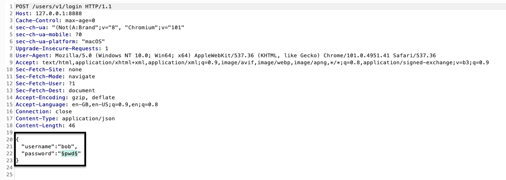

We found the password of the user Bob to be "1234"

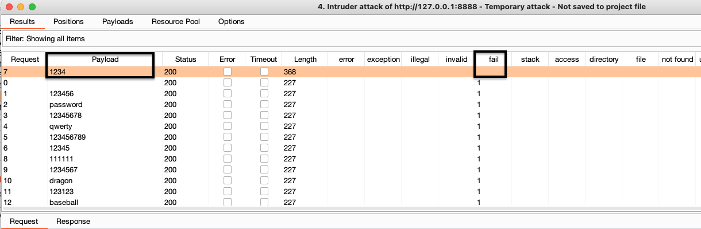

### Mitigation

- Require users to use long and strong passwords (ideally passphrases).
- Encourage users to use a password manager.
- Use CAPTCHAs after multiple failed logins.
- Rate limit login attempts to lock users out after repeated unsuccessful attempts within a short timeframe.
- Lock down administration access to specific IP addresses.

## Excessive Data Exposure through debug endpoint

### Description
Excessive data exposure occurs when an application, via API response, returns more information than necessary for a user to perform a specific action.
When web and mobile apps regularly rely on API calls that return more information to the user than necessary, those responses expose unfiltered data that an attacker can take advantage of to gain sensitive information.


### PoC
When sending the GET-Request

```GET /users/v1/_debug```

,the response in BuroSuite is showing information about all users.
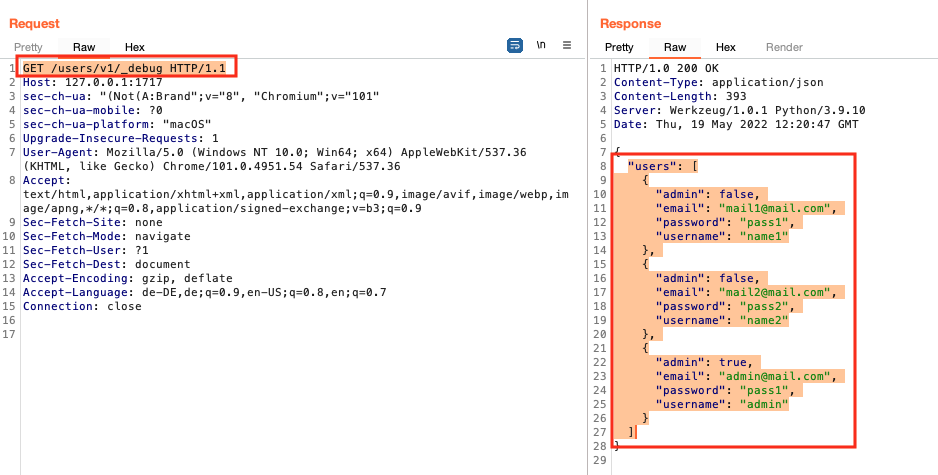

### Mitigation
An API security solution must be able to identify and report on the large variety of sensitive data types that can be sent in API requests and responses. These solutions must also have the ability to baseline and track API access per endpoint and per user in order to identify excessive consumption of sensitive data. These solutions must also provide API context and a range of response actions so that not every transmission of sensitive data results in an alert or blocked request.

